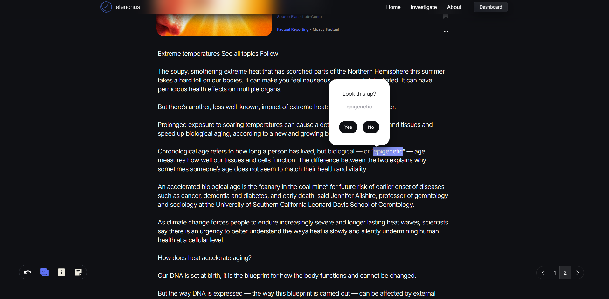
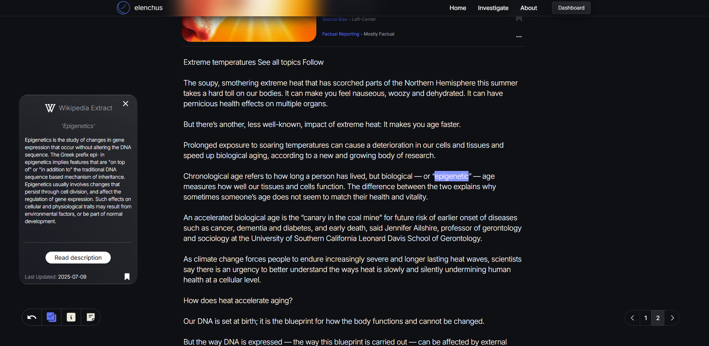

# Elenchus

Elenchus is a focused research platform that applies the Socratic method to modern media.  
It guides users through structured questioning to challenge assumptions and biases,  
then retrieves and summarizes relevant news articles with bias ratings and 
metadata - all inside a performant, interactive interface optimized for large-scale content.

## Since launch, Elenchus has evolved into a **production-grade full-stack application** featuring:

- Wikipedia Context Extraction - when relevant, automatically pulls concise Wikipedia summaries 
for key people, events, or topics mentioned in articles, providing instant background context 
without leaving the app.

- Bias & Integrity Tracking Dashboard - generates charts that visualize 
trends in: 1. Political bias of sources you reference, 2. Journalistic integrity ratings over time, 
and 3. How your perspecitves have been effected by your investigations over time.

- Topic Discovery via Bluesky Feed - Displays a curated feed of recent Bluesky posts, 
allowing users to discover trending or thought-provoking topics. Users can search 
for specific themes being discussed and launch investigations directly 
from these posts — no need to start from scratch.

- Virtualized infinite scrolling on large lists of data for performance at scale

- Concurrent API request handling with fault tolerance

- Integrated media bias and reliability ratings via MBFC API

- Server-side Supabase operations for secure, efficient data handling

## Table of Contents

1. Features

2. Tech Stack

3. Architecture

4. Prerequisites

5. Installation

6. Configuration

7. Running the App

8. Usage

9. Deployment

10. Contributing

11. License

## Features

##### Socratic Reflection Workflow:

Guide users to pinpoint a statement they’re unsure about, then prompt them to articulate underlying assumptions, biases, and questions before beginning their research.

##### Article Search & Summarization:

Fetch news via the Bing News API and scrape article content via TLDRThis API.

##### Argument Mapping:

Record your thought process and link evidence to claims.

##### User Profiles:

Secure authentication and data persistence with Supabase.

##### Smooth Animations:

Mount/unmount transitions and interactive elements via Framer Motion.

## Tech Stack

Frontend: Astro.js + React SPA

Backend: Node.js + Express.js

Database & Auth: Supabase

Styling: Tailwind CSS

Animations: Framer Motion + Lottie-React

API Integration: Bing News API

## Architecture

[Client (Astro/React)] <--> [API Server (Express)] <--> [Supabase DB]
\---> [Bing News API]

Client: Renders interactive pages, handles routing(React-Router-Dom) and state (Redux Toolkit).

Server: Exposes REST endpoints, handles user sessions, proxies news requests, and sanitizes responses.

Database: Stores user profiles, saved investigations, and article metadata.

## Prerequisites

Node.js v16+

npm or yarn

Supabase project (for Auth and DB)

Bing News API key

RapidAPI API key

## Installation

Clone the repo

git clone https://github.com/yourusername/elenchus.git
cd elenchus

Install dependencies

Root (Frontend + Server)

npm install

# or

yarn install

Client

cd client && npm install

Server

cd server && npm install

## Configuration

Environment Variables

Create a .env file in /server:

SUPABASE_URL=<your-supabase-url>
SUPABASE_KEY=<your-supabase-key>
NEWS_API_KEY=<your-bing-news-api-key>

Optionally, create a .env in /client for client-specific configs.

## Running the App

Development

### From project root

npm run dev

Starts Astro dev server on http://localhost:3000

Starts Express server on http://localhost:4000

Production Build

npm run build
npm run start

## Usage

Register or log in via Supabase OAuth.

Enter a statement or belief in the investigation flow.

Answer guided reflection prompts.

Browse and select articles; view AI‑generated summaries.

Save investigations to your profile or export data.

## Deployment

This project is organized as a monorepo with separate client and server folders and is deployed as a single Heroku app.

Create & Configure Heroku App

heroku login
heroku create your-app-name

Monorepo Build Setup

Option A: Heroku Monorepo Buildpack

heroku buildpacks:clear
heroku buildpacks:set heroku/nodejs
heroku buildpacks:add https://github.com/lstoll/heroku-buildpack-monorepo
heroku config:set PROJECT_PATH=server

Option B: Root heroku-postbuild Script
Add to your root package.json:

"scripts": {
"heroku-postbuild": "npm install --prefix client && npm run build --prefix client && npm install --prefix server"
}

Procfile
In the project root, create a file named Procfile containing:

web: npm run start --prefix server

Environment Variables
Set required keys via CLI or Heroku dashboard:

heroku config:set \
 SUPABASE_URL=<your-supabase-url> \
 SUPABASE_KEY=<your-supabase-key> \
 NEWS_API_KEY=<your-bing-news-api-key>

Deploy
Commit your changes and push to Heroku:

git push heroku main

Heroku will install dependencies, build the client, and launch the server automatically.

Verify Deployment
Visit https://your-app-name.herokuapp.com to confirm everything is running correctly.

## Contact

Trent Irvin – trentirvin51@gmail.com

Said Gadzhiev - saga080700@gmail.com

Project Link: https://github.com/TrentM1997/ElenchusBackup
